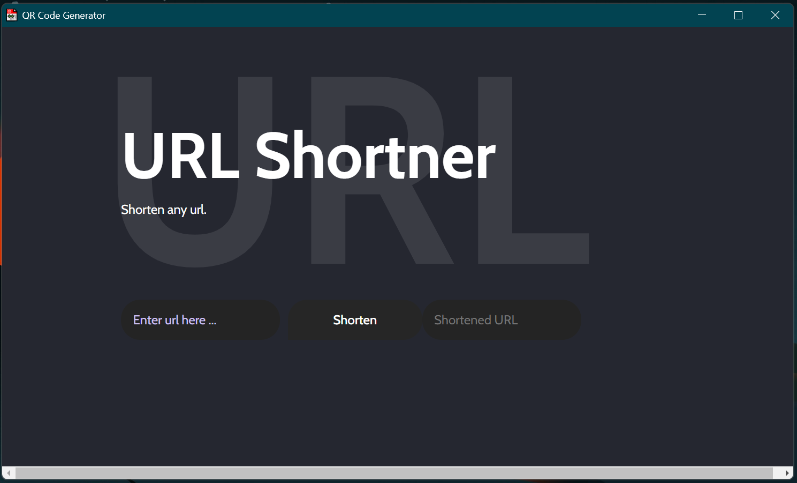

# Url Shortner 
A url shortener made using python as a backend and html, css and javascript as frontend.
 It uses the eel module of python to run the application.

---

## Requirements
- Python 3.6 or above installed in your system.

- ```pip install pyshorteners``` or ```pip3 install pyshorteners```

- ```pip install eel``` or ```pip3 install eel```

---

## Official Documentations

- Documentation for [**Eel**](https://github.com/ChrisKnott/Eel) 

- Documentaiton for [**Pyshortener**](https://pyshorteners.readthedocs.io/en/latest/)

---
## Screenshot


---

## Quote
>> Hustle beats talent when talent doesn't hustle.